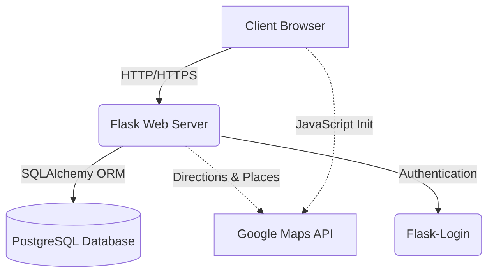

# 🚗 BroLift — Smart College Carpooling System

A high-performance, full-stack carpooling platform designed exclusively for college networks. BroLift enables students to share rides, split fuel costs accurately, and commute sustainably through a verified academic network.

[](https://www.python.org/)
[](https://flask.palletsprojects.com/)
[](https://www.postgresql.org/)
[](https://developers.google.com/maps)
[](https://github.com/sarvesh-raam/BroLift/actions)

---

## 📸 Project Gallery
> [!TIP]
> **To add your own screenshots**: Replace the placeholders below with your image files (upload them to a `docs/images` folder in this repo).

| Home Dashboard | Real-time Search | Ride Management |
| :---: | :---: | :---: |
|  |  |  |

---

## 🌟 Key Features

*   🛡️ **Academic Network Verification**: Strict registration flow validating only verified `@srmist.edu.in` email addresses using regex patterns and domain checks.
*   🗺️ **Intelligent Route Matching**: Integration with **Google Directions API** for precise polyline visualization and real-time distance calculations.
*   💰 **Fair-Cost Algorithm**: Automated fuel cost division based on vehicle mileage, local fuel prices (Petrol/Diesel/CNG), and passenger count.
*   🌓 **Premium UI/UX**: Professional Material Design interface with **Full Dark Mode** support and responsive layouts optimized for mobile devices.
*   💬 **In-App Communication**: Real-time ride lobby for approved passengers to coordinate pickup details.
*   📅 **Smart Scheduling**: Inline date and time pickers powered by `Flatpickr` for a seamless booking experience.

---

## 🛠️ Tech Stack & Architecture

### **Core Systems**
- **Backend**: Python 3.10+ utilizing the **Flask** micro-framework.
- **Frontend**: Semantic HTML5, Vanilla CSS3 (Custom Design System), and JavaScript (ES6+).
- **Database**: **PostgreSQL** (Production) / SQLite (Local Development) with **SQLAlchemy ORM**.
- **Security**: Password hashing via `Werkzeug` and CSRF protection via `Flask-WTF`.

### **Architecture**


---

## 🧪 Automated Testing
This project follows professional testing standards to ensure reliability:
- **End-to-End Integration Tests**: Automated scripts simulating the full lifecycle from User Registration -> Ride Hosting -> Passenger Request -> Host Approval -> Ride Completion.
- **CI/CD Pipeline**: GitHub Actions automatically run linting and build checks on every push to the `main` branch.

To run tests locally:
```bash
python -X utf8 test_app.py
```

---

## 🚀 Getting Started

### 1. Prerequisites
- Python 3.10+
- Google Maps JavaScript API Key (with Places and Directions enabled)

### 2. Installation
```bash
# Clone the repository
git clone https://github.com/sarvesh-raam/BroLift.git
cd BroLift

# Install dependencies
pip install -r requirements.txt
```

### 3. Configuration
Create a `.env` file in the root directory:
```env
FLASK_SECRET_KEY=your_secret_key
DATABASE_URL=sqlite:///brolift.db
GOOGLE_MAPS_API_KEY=your_google_maps_key
```

### 4. Run the App
```bash
python run.py
```
Visit `http://localhost:5000` on your browser.

---

## 📄 License
Distributed under the **MIT License**. See `LICENSE` for more information.

---

## 🤝 Contribution
Contributions are what make the open-source community such an amazing place to learn, inspire, and create. Any contributions you make are **greatly appreciated**.

1. Fork the Project
2. Create your Feature Branch (`git checkout -b feature/AmazingFeature`)
3. Commit your Changes (`git commit -m 'add some amazingfeature'`)
4. Push to the Branch (`git push origin feature/AmazingFeature`)
5. Open a Pull Request
