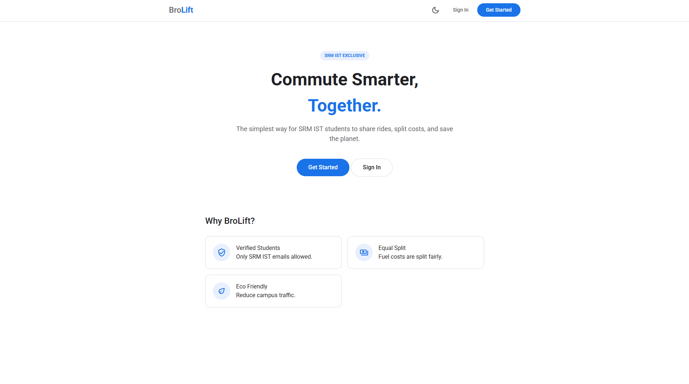
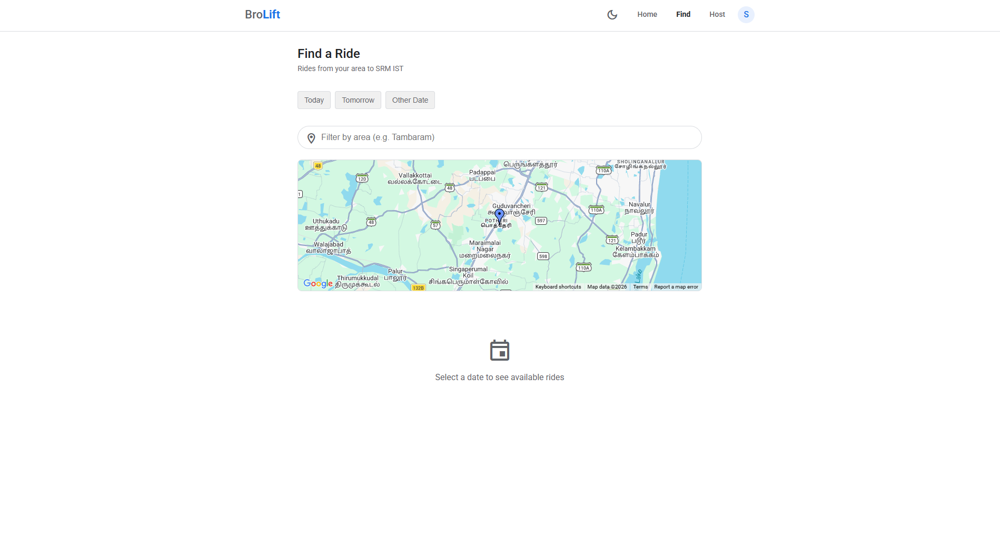
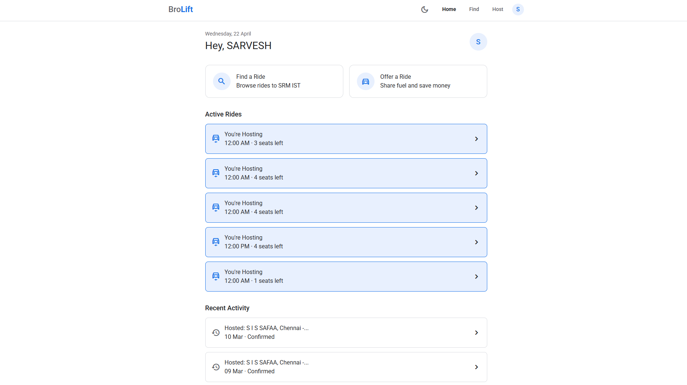
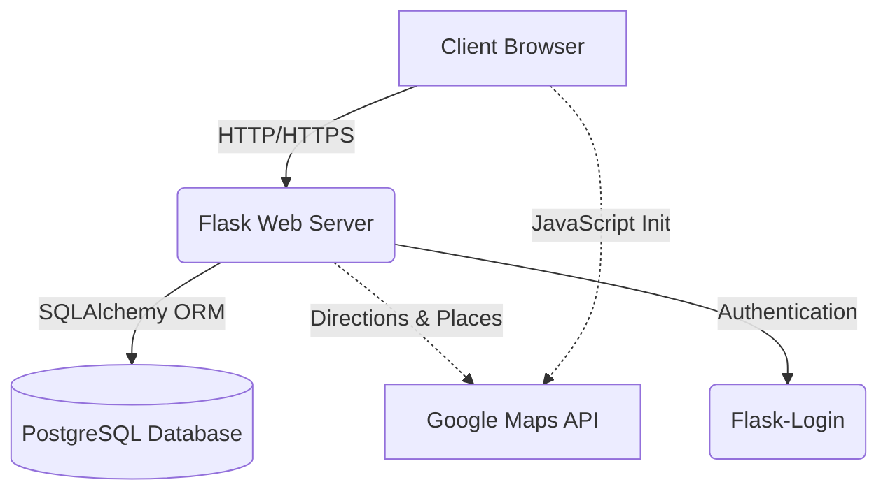
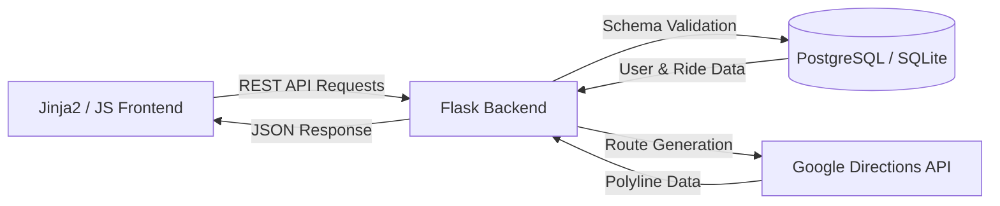

# 🚗 BroLift: Smart College Carpooling Network

A high-performance system for academic commute coordination. It cross-references student verification with real-time routing to optimize campus transport and reduce structural inefficiencies in college transit.

[](https://github.com/sarvesh-raam/BroLift/actions)
[](https://brolift.onrender.com)
[](https://opensource.org/licenses/MIT)

---

## Executive Summary
BroLift (Autonomous Ride Intelligence) provides high-fidelity carpooling coordination. The system automates the matching of student drivers and passengers within a verified network by integrating Google Maps routing and deterministic fuel-cost inference models.

👉 **Optimized for low-latency responses, generating route calculations within milliseconds.**
👉 **Designed as a scalable full-stack system capable of handling real-time ride tracking with optimized passenger matching.**

## Interface Preview

| Home Dashboard | Real-time Search | Ride Management |
| :---: | :---: | :---: |
|  |  |  |

## Deployment
- **Frontend & API**: Deployed on Render [View Live Dashboard](https://brolift.onrender.com)
- **Database Layer**: Managed PostgreSQL instance on Render

## Architecture Diagram



<details>
<summary>View detailed dependency graph</summary>


</details>

## System Design
- Handles verified academic ingestion pipeline (@srmist.edu.in)
- Uses spatial indexing for efficient pickup retrieval
- Optimized API responses for low latency route calculation

## System Architecture & Components
- **Frontend Dashboard**: Responsive Material Design interface providing real-time ride discovery.
- **Backend API**: Python Flask layer handling ride lifecycle, orchestration, and integrations.
- **Network Infrastructure**: Strict SRM IST email verification combined with regex-based credential auditing.
- **Routing Intelligence Mesh**: High-performance inference via Google Maps API for institutional transit reasoning.
- **Strategic Cost Gateway**: Real-time integration with fuel price metrics for fair-split financials.

## API Flow
1. **Ride Creation (`/rides/host`)**: Hosts define route and capacity; data is serialized into PostgreSQL.
2. **Ride Query (`/rides/find`)**: Passengers perform spatial searches against the ride database.
3. **Request Logic**: Passengers request joins; backend validates capacity and overlaps.
4. **Financial Evaluation**: Cost-per-head is computed using real-time fuel data and vehicle mileage.
5. **Route Visualization**: Polylines are generated and streamed to the frontend via Google Maps JS SDK.

## Example Output Payload
```json
{
  "status": "success",
  "data": {
    "ride_id": 104,
    "classification": "Standard Car",
    "route": "SRM Main Gate -> Chennai Central",
    "cost_per_head": 142.50,
    "confidence_level": 0.98
  }
}
```

## Environment & Deployment

### Hardware & Engine Requirements
- Python 3.10+ Runtime
- PostgreSQL 15+ 
- External API Gateways: Google Maps (Directions, Places, Maps)

### Infrastructure Initialization
**A. Application Service (Flask)**
```bash
# Initialize environment
python -m venv venv
source venv/bin/activate
pip install -r requirements.txt

# Run server
python run.py
```

## Technical Roadmap
- Multi-Agent Orchestration: Implementation of automated pickup scheduling loops to increase detection accuracy.
- SRM/KTR Integration: Direct ingestion of campus event schedules for high-demand ride prediction.

## License
Distributed under the MIT License. Professional use only.
